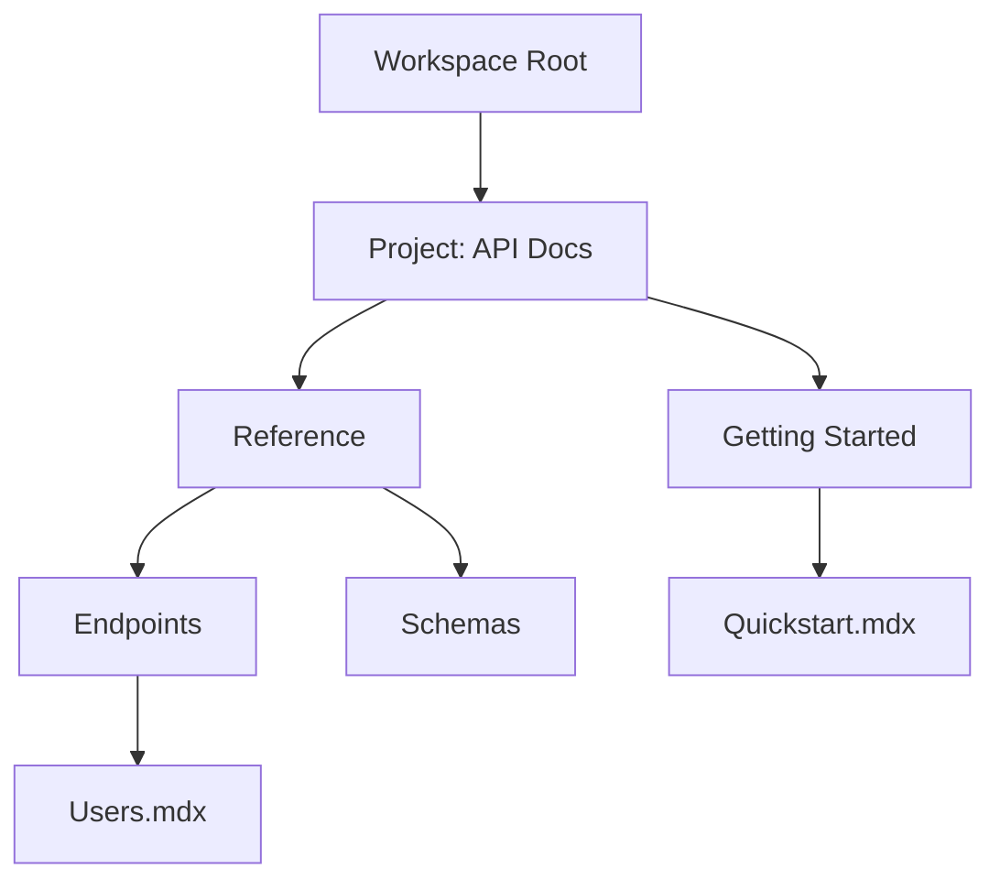

## Overview

Tiew Hoe Ting provides a flexible system for organizing documentation through projects, workspaces, hierarchies, and collaboration tools. You create projects to group related docs, manage workspaces for team environments, structure content hierarchically, and share securely. These concepts form the foundation for scalable documentation.

<Columns cols={2}>
  <Card title="Projects" icon="folder" href="/docs/projects">
    Group related documentation into isolated projects.
  </Card>
  <Card title="Workspaces" icon="layout" href="/docs/workspaces">
    Team environments for collaborative editing.
  </Card>
  <Card title="Hierarchies" icon="tree" href="/docs/hierarchies">
    Nested structures for organized navigation.
  </Card>
  <Card title="Sharing" icon="share-2" href="/docs/sharing">
    Permissions and public links for access control.
  </Card>
</Columns>

## Projects and Workspaces

Projects contain your documentation files, while workspaces provide shared environments for teams. You assign projects to one or more workspaces to control access.

| Feature          | Projects                          | Workspaces                       |
|------------------|-----------------------------------|----------------------------------|
| Scope            | Single collection of docs         | Team collaboration space         |
| Access Control   | Owner-managed permissions         | Role-based (admin, editor, view) |
| Use Case         | Personal or product docs          | Cross-project team docs          |

<Callout kind="tip">
  Start with a single project per product, then add workspaces as your team grows.
</Callout>

<Steps>
  <Step title="Create a Project" icon="plus">
    Navigate to the dashboard and select `New Project`. Enter a name like `API Docs v2`.
  </Step>
  <Step title="Assign to Workspace" icon="users">
    In project settings, link to an existing workspace or create `Engineering Workspace`.
  </Step>
  <Step title="Invite Members" icon="mail">
    Add users via email; assign roles like `Editor` for contributions.
  </Step>
</Steps>

## Document Structures and Hierarchies

You organize documents into nested hierarchies using folders and frontmatter. This creates intuitive navigation sidebars.



Use YAML frontmatter in `.mdx` files to define metadata and navigation.

<CodeGroup tabs="Frontmatter,Sidebar Config">
  ```yaml
  ---
  title: Quickstart
  description: Get started with Tiew Hoe Ting API.
  sidebar_position: 1
  ---
  ```
  ```javascript
  // sidebar.js
  export default {
    api: [
      'quickstart',
      {
        type: 'category',
        label: 'Endpoints',
        items: ['users', 'projects']
      }
    ]
  };
  ```
</CodeGroup>

## Collaboration and Sharing

Enable real-time editing and granular permissions. You control who views, edits, or publishes docs.

<Tabs>
  <Tab title="Internal Teams" icon="users">
    Assign workspace roles:
    - `Admin`: Full control
    - `Editor`: Edit and approve
    - `Viewer`: Read-only

    <Expandable title="Advanced Permissions" default-open="false">
      Use branch protection for publish workflows.
    </Expandable>
  </Tab>
  <Tab title="Public Sharing" icon="globe">
    Generate read-only links or embed docs.

    ```bash
    curl -X POST /api/v1/sharing \
      -H "Authorization: Bearer {TOKEN}" \
      -d '{"projectId": "proj_123", "public": true}'
    ```
  </Tab>
  <Tab title="Export Options" icon="download">
    Export to PDF, HTML, or Markdown ZIP.
  </Tab>
</Tabs>

<Callout kind="info">
  Always review changes before publishing to maintain documentation quality.
</Callout>

These core concepts enable you to build maintainable, collaborative documentation at scale. Explore projects first to structure your content effectively.