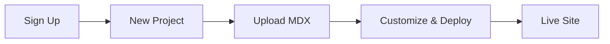

## Overview

Get started with Tiew Hoe Ting in under 5 minutes. Follow these steps to create an account, set up your first project, and organize your documentation. Tiew Hoe Ting handles MDX parsing, component rendering, and deployment automatically.

<Callout kind="tip">
  Prerequisites: A modern browser and a free account. No local setup required for basic usage.
</Callout>

## Step-by-Step Setup

Use these numbered steps to launch your documentation site.

<Steps>
  <Step title="Create Account and Log In" icon="user-plus">

    Visit [tiewhoeting.com/signup](https://tiewhoeting.com/signup) and choose your sign-up method.

    <Tabs>
      <Tab title="Email" icon="mail">
        Enter your email and create a strong password. Verify your email to activate.
      </Tab>
      <Tab title="GitHub" icon="github">
        Authorize Tiew Hoe Ting to access your GitHub account for seamless repo integration.
      </Tab>
    </Tabs>

    After login, you'll land on the dashboard.

  </Step>

  <Step title="Create Your First Project" icon="plus">

    From the dashboard, click **New Project**.

    <CodeGroup tabs="Web CLI">
      ```bash
      # Optional CLI for advanced users
      npx @tiewhoeting/cli@latest create my-docs --template quickstart
      ```
      ```javascript
      // API example for programmatic creation
      const response = await fetch('https://api.tiewhoeting.com/v1/projects', {
        method: 'POST',
        headers: { 'Authorization': `Bearer ${YOUR_API_TOKEN}`, 'Content-Type': 'application/json' },
        body: JSON.stringify({
          name: 'My Documentation',
          description: 'Project docs'
        })
      });
      ```
    </CodeGroup>

    Name your project `my-docs` and select the default MDX template.

  </Step>

  <Step title="Upload and Organize Documents" icon="upload">

    In your project sidebar, use the **Upload** button or drag-and-drop MDX files.

    Create your first page at `quickstart.mdx`:

````mdx
```mdx
---
title: Welcome
description: Your first doc page.
---

## Hello World

Welcome to Tiew Hoe Ting!
```
````

    Organize files in folders like `guides/`, `api/`, and `changelog.mdx` for automatic navigation.

  </Step>
</Steps>

## Next Steps

Explore these key features to enhance your site.

<Columns cols={3}>
  <Card title="Customize Theme" icon="palette" href="/docs/themes">
    Adjust colors starting with brand color `#3B82F6`. Preview live changes.
  </Card>
  <Card title="Add Team Members" icon="users" href="/docs/collaboration">
    Invite collaborators with role-based access: admin, editor, viewer.
  </Card>
  <Card title="Deploy Site" icon="rocket" href="/docs/deploy">
    Generate a custom domain like `docs.tiewhoeting.com/my-docs`.
  </Card>
</Columns>

## Advanced Configuration

<Expandable title="Optional: Environment Variables" default-open="false">

    Set up secrets for production builds.

    ```bash
    TIEWHOETING_API_TOKEN=your_token_here
    CUSTOM_DOMAIN=docs.example.com
    ```

    Use these in your project settings under **Environment**.

  </Expandable>

<Callout kind="success">
  Congratulations! Your documentation site is live. Visit your project URL to preview.
</Callout>

